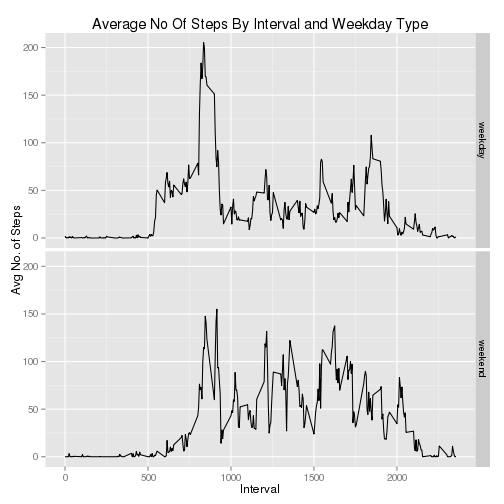

### Loading and Pre-processing

1. Download the data from the web.


```r
fileURL <- "https://d396qusza40orc.cloudfront.net/repdata%2Fdata%2Factivity.zip"
temp <- tempfile()
download.file(fileURL, destfile=temp, method="curl")
con <- unz(temp, "activity.csv")
```

2. Load the data from CSV into a data frame and view the top 15 rows.


```r
activitydata <- read.csv(con, header=TRUE, na.strings=c("NA")) 
head(activitydata, 15)
```

```
##    steps       date interval
## 1     NA 2012-10-01        0
## 2     NA 2012-10-01        5
## 3     NA 2012-10-01       10
## 4     NA 2012-10-01       15
## 5     NA 2012-10-01       20
## 6     NA 2012-10-01       25
## 7     NA 2012-10-01       30
## 8     NA 2012-10-01       35
## 9     NA 2012-10-01       40
## 10    NA 2012-10-01       45
## 11    NA 2012-10-01       50
## 12    NA 2012-10-01       55
## 13    NA 2012-10-01      100
## 14    NA 2012-10-01      105
## 15    NA 2012-10-01      110
```

```r
unlink(temp)
```

3. Perform some formatting of the columns into the right data types.


```r
library(lubridate)
activitydata$steps <- as.numeric(activitydata$steps)
activitydata$interval <- as.numeric(activitydata$interval)
activitydata$date <- ymd(activitydata$date)
str(activitydata)
```

```
## 'data.frame':	17568 obs. of  3 variables:
##  $ steps   : num  NA NA NA NA NA NA NA NA NA NA ...
##  $ date    : POSIXct, format: "2012-10-01" "2012-10-01" ...
##  $ interval: num  0 5 10 15 20 25 30 35 40 45 ...
```

4. Load other required libaries.


```r
library(dplyr)
```

### What is the mean total number of steps taken per day?

1. Calculate the total number of steps taken per day.


```r
ad <- activitydata %>%
        group_by(date) %>%
        filter(!is.na(steps)) %>%
        summarise(sumsteps = sum(steps)) %>%
        print()
```

```
## Source: local data frame [53 x 2]
## 
##          date sumsteps
## 1  2012-10-02      126
## 2  2012-10-03    11352
## 3  2012-10-04    12116
## 4  2012-10-05    13294
## 5  2012-10-06    15420
## 6  2012-10-07    11015
## 7  2012-10-09    12811
## 8  2012-10-10     9900
## 9  2012-10-11    10304
## 10 2012-10-12    17382
## ..        ...      ...
```

2. Generate the histogram to show the frequency distribution of the number of steps.


```r
hist(ad$sumsteps)
```

 

3. Determine the mean and median of the total number of steps.


```r
meansteps <- mean(ad$sumsteps)
medsteps <- median(ad$sumsteps)
meansteps
```

```
## [1] 10766.19
```

```r
medsteps
```

```
## [1] 10765
```

The mean of the daily total number of steps is **1.076619 &times; 10<sup>4</sup>** and the median is **1.0765 &times; 10<sup>4</sup>**.

### What is the average daily pattern?

1. Determine the average number of steps for each interval across all days.


```r
ad <- activitydata %>%
        group_by(interval) %>%
        filter(!is.na(steps)) %>%
        summarise(sumsteps = sum(steps), 
                  meansteps = mean(steps), 
                  mediansteps = median(steps)) %>%
        print()
```

```
## Source: local data frame [288 x 4]
## 
##    interval sumsteps meansteps mediansteps
## 1         0       91 1.7169811           0
## 2         5       18 0.3396226           0
## 3        10        7 0.1320755           0
## 4        15        8 0.1509434           0
## 5        20        4 0.0754717           0
## 6        25      111 2.0943396           0
## 7        30       28 0.5283019           0
## 8        35       46 0.8679245           0
## 9        40        0 0.0000000           0
## 10       45       78 1.4716981           0
## ..      ...      ...       ...         ...
```

```r
str(ad)
```

```
## Classes 'tbl_df', 'tbl' and 'data.frame':	288 obs. of  4 variables:
##  $ interval   : num  0 5 10 15 20 25 30 35 40 45 ...
##  $ sumsteps   : num  91 18 7 8 4 111 28 46 0 78 ...
##  $ meansteps  : num  1.717 0.3396 0.1321 0.1509 0.0755 ...
##  $ mediansteps: num  0 0 0 0 0 0 0 0 0 0 ...
##  - attr(*, "drop")= logi TRUE
```

2. Create a time-series plot.

```r
plot(y=ad$meansteps, x=ad$interval, type="l")
```

 

3. Determine the maximum number of steps and the interval it belongs in.


```r
maxsteps <- max(ad$meansteps)
whichint <- ad[ad$meansteps==maxsteps,]$interval
maxsteps
```

```
## [1] 206.1698
```

```r
whichint
```

```
## [1] 835
```

The maximum number of steps is **206.1698113** and it occurred in interval **835**.

### Imputing missing values

1. Count the number of NAs.


```r
numNA <- sum(ifelse(is.na(activitydata$steps),1,0))
numNA
```

```
## [1] 2304
```

There are **2304** NA records.

2. To fill up the NAs, assign it to the median no. of steps for the interval.


```r
ad2 <- activitydata
ad2$steps <- apply(ad2, 1, function(x) ifelse(is.na(x[1]),ad[ad$interval==as.numeric(x[3]),]$mediansteps,x[1]))
ad2$steps <- as.numeric(ad2$steps)
str(ad2)
```

```
## 'data.frame':	17568 obs. of  3 variables:
##  $ steps   : num  0 0 0 0 0 0 0 0 0 0 ...
##  $ date    : POSIXct, format: "2012-10-01" "2012-10-01" ...
##  $ interval: num  0 5 10 15 20 25 30 35 40 45 ...
```

3. List out a portion of the new data set.


```r
head(ad2)
```

```
##   steps       date interval
## 1     0 2012-10-01        0
## 2     0 2012-10-01        5
## 3     0 2012-10-01       10
## 4     0 2012-10-01       15
## 5     0 2012-10-01       20
## 6     0 2012-10-01       25
```

4. Generate the histogram.


```r
hist(ad2$steps)
```

 

5. Determine the mean and median.


```r
ad3 <- ad2 %>%
        group_by(date) %>%
        summarise(sumsteps = sum(steps),
                  meansteps = mean(steps), 
                  mediansteps = median(steps)) %>%
        print()
```

```
## Source: local data frame [61 x 4]
## 
##          date sumsteps meansteps mediansteps
## 1  2012-10-01     1141  3.961806           0
## 2  2012-10-02      126  0.437500           0
## 3  2012-10-03    11352 39.416667           0
## 4  2012-10-04    12116 42.069444           0
## 5  2012-10-05    13294 46.159722           0
## 6  2012-10-06    15420 53.541667           0
## 7  2012-10-07    11015 38.246528           0
## 8  2012-10-08     1141  3.961806           0
## 9  2012-10-09    12811 44.482639           0
## 10 2012-10-10     9900 34.375000           0
## ..        ...      ...       ...         ...
```

```r
meansteps2 <- mean(ad3$sumsteps)
medsteps2 <- median(ad3$sumsteps)
```

The mean and median number of steps is **9503.8688525** and **1.0395 &times; 10<sup>4</sup>** respectively. We can do up a table to compare the original and the imputed means and medians.


```r
tblcompare <- matrix(c(meansteps, medsteps, meansteps2, medsteps2, 
                       (meansteps2-meansteps)/meansteps*100, 
                       (medsteps2-medsteps)/medsteps*100), 
                       nrow=2, ncol=3)
colnames(tblcompare) <- c("orig","imputed", "%-change")
rownames(tblcompare) <- c("mean", "median")
tblcompare
```

```
##            orig   imputed   %-change
## mean   10766.19  9503.869 -11.724853
## median 10765.00 10395.000  -3.437065
```

It can be seen that imputing values resulted in a lower median and mean.

### Are there differences in activity patterns between weekdays and weekends

1. Create the new weekdaytype factor variable.


```r
ad4 <- ad2 %>%
          mutate(weekdaytype = 
                   ifelse(weekdays(date,abbreviate=TRUE)=="Sat" |
                          weekdays(date,abbreviate=TRUE)=="Sun",
                          "weekend","weekday")) %>%
          group_by(date, weekdaytype) %>%
          summarise(sumsteps = sum(steps)) %>%
          print()
```

```
## Source: local data frame [61 x 3]
## Groups: date
## 
##          date weekdaytype sumsteps
## 1  2012-10-01     weekday     1141
## 2  2012-10-02     weekday      126
## 3  2012-10-03     weekday    11352
## 4  2012-10-04     weekday    12116
## 5  2012-10-05     weekday    13294
## 6  2012-10-06     weekend    15420
## 7  2012-10-07     weekend    11015
## 8  2012-10-08     weekday     1141
## 9  2012-10-09     weekday    12811
## 10 2012-10-10     weekday     9900
## ..        ...         ...      ...
```

The above illustrates that the weekdaytype factor is working.

2. Aggregate by interval and weekday.


```r
ad5 <- ad2 %>%
          mutate(weekdaytype = 
                   ifelse(weekdays(date,abbreviate=TRUE)=="Sat" |
                          weekdays(date,abbreviate=TRUE)=="Sun",
                          "weekend","weekday")) %>%
          group_by(interval, weekdaytype) %>%
          summarise(sumsteps = sum(steps),
                    meansteps = mean(steps), 
                    mediansteps = median(steps)) %>%  
          print()
```

```
## Source: local data frame [576 x 5]
## Groups: interval
## 
##    interval weekdaytype sumsteps  meansteps mediansteps
## 1         0     weekday       91 2.02222222           0
## 2         0     weekend        0 0.00000000           0
## 3         5     weekday       18 0.40000000           0
## 4         5     weekend        0 0.00000000           0
## 5        10     weekday        7 0.15555556           0
## 6        10     weekend        0 0.00000000           0
## 7        15     weekday        8 0.17777778           0
## 8        15     weekend        0 0.00000000           0
## 9        20     weekday        4 0.08888889           0
## 10       20     weekend        0 0.00000000           0
## ..      ...         ...      ...        ...         ...
```

3. Plot average number of steps taken for each 5-min interval for all weekdays.


```r
library(ggplot2)
graph <- ggplot(ad5, aes(x=interval, y=meansteps)) +
  geom_line() +
#  geom_text(aes(size=1)) +
  facet_grid(weekdaytype ~ .) +
  labs(x="Interval", y="Avg No. of Steps") +
  ggtitle("Average No Of Steps By Interval and Weekday Type")
print(graph)
```

 
